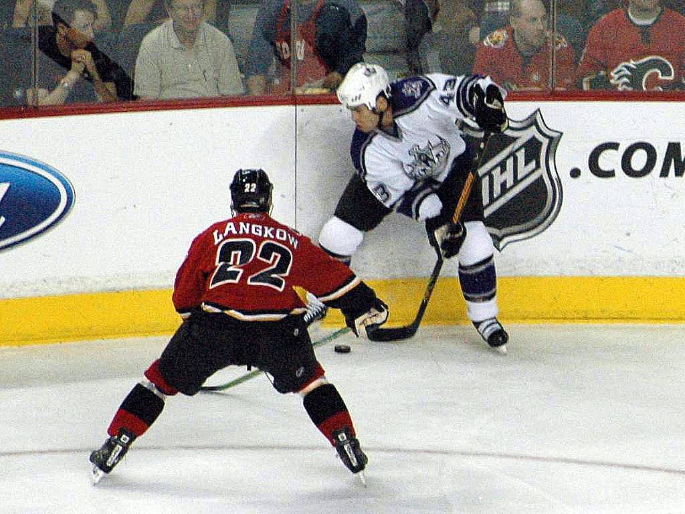

```{r setup, include=FALSE}
knitr::opts_chunk$set(echo = TRUE,message = FALSE,warning = FALSE)
```

# Introduction
## Description of JSON Data
### What it is?

JSON (JavaScript Object Notation) is an open standard file format, and data interchange format, that uses human-readable text to store and transmit data objects consisting of attribute–value pairs and array data types (or any other serializable value). JSON is a language-independent data format. It was derived from JavaScript, but many modern programming languages include code to generate and parse JSON-format data.(https://en.wikipedia.org/wiki/JSON)

### Where does it get used?

JSON is commonly used for transmitting data in web applications (e.g., sending some data from the server to the client, so it can be displayed on a web page, or vice versa). And It’s also becoming an increasingly common format for database migration from modern apps (such as MixPanel, SalesForce, and Shopify) over to SQL databases.(https://developer.mozilla.org/en-US/docs/Learn/JavaScript/Objects/JSON)

### Why is it a good way to store data?

JSON is perfect for storing temporary data that’s consumed by the entity that creates the data. A good example is user-generated data such as filling out a form or information exchange between an API and an app. Stored JSON data must be text but this means JSON can be used as a data format for any programming language, providing a high level of interoperability. It also means data stored in JSON files are easily sent between servers. This is a bonus for database migration.(https://blog.sqlizer.io/posts/json-store-data/)

## Discussion on R packages for reading JSON data

- `rjson`: This does not use S4/S3 methods and so is not readily extensible, but still useful. Unfortunately, it does not used vectorized operations and so is too slow for non-trivial data. Similarly, for reading JSON data into R, it is somewhat slow and so does not scale to large data, should this be an issue.

- `RJSONIO`: This is an alternative to `rjson` package. Originally, that was too slow for converting large R objects to JSON and was not extensible. rjson's performance is now similar to this package, and perhaps slightly faster in some cases. The two packages intentionally share the same basic interface. This package (`RJSONIO`) has many additional options to allow customizing the generation and processing of JSON content. This package uses libjson rather than implementing yet another JSON parser. 

- `jsonlite`: This is a fork of the `RJSONIO` package. It builds on the parser from `RJSONIO` but implements a different mapping between R objects and JSON strings. The C code in this package is mostly from the `RJSONIO` Package, the R code has been rewritten from scratch. In addition to drop-in replacements for `fromJSON` and `toJSON`, the package has functions to serialize objects. Furthermore, the package contains a lot of unit tests to make sure that all edge cases are encoded and decoded consistently for use with dynamic data in systems and applications. Thus, I choose `jsonlite`.

## NHL & NHL Data
### What is NHL?
```{r pic,out.width="50%"}
# prepare for the package
library(knitr)
# show the NHL picture

```

The National Hockey League (NHL) is a professional ice hockey league in North America, currently comprising 31 teams: 24 in the United States and seven in Canada. The NHL is considered to be the premier professional ice hockey league in the world, and one of the major professional sports leagues in the United States and Canada. The Stanley Cup, the oldest professional sports trophy in North America, is awarded annually to the league playoff champion at the end of each season.(https://en.wikipedia.org/wiki/National_Hockey_League)

The NHL divides the 31 teams into two conferences: the Eastern Conference and the Western Conference. Each conference is split into two divisions: the Eastern Conference contains 16 teams (eight per division), while the Western Conference has 15 teams (seven in the Central Division and eight in the Pacific Division). The current alignment has existed since the 2017–18 season.(https://en.wikipedia.org/wiki/Category:National_Hockey_League_teams)

### Get the NHL data

```{r library}
# prepare for the packages
library(httr)
library(jsonlite)
library(tidyverse)
```

```{r getData}
# write a function to get specific url
url <- function(kind,ID=NULL){
  base_url <- "https://records.nhl.com/site/api/franchise"
  if(kind == "base"){
    return("https://records.nhl.com/site/api/franchise")}
  else if(kind == "TeamTotal"){
    return( paste(base_url, "team","totals", sep="-"))
  }else{
    return(paste0(paste(base_url,kind,"records",sep="-"),"?",paste("cayenneExp","franchiseId",ID,sep="=")))
  }
}

# write a function to get data from specific url
GetData <- function(url){
  url %>%
    GET(.) %>%
    # turn it into JSON text form
    content(as="text") %>%
    # convert it to a list
    fromJSON(flatten=TRUE) 
}

# call above two functions together to get specific data
franchiseRaw <- GetData(url("base"))$data
teamtotalRaw <- GetData(url("TeamTotal"))$data

# write a function to combine all the id(1-38) of specific table
CData <- function(kind){
  y <- NULL
  for(i in 1:38){
    x <- GetData(url(kind,ID=as.character(i)))$data
    y <- rbind(x,y)
  }
  return(y)
}

# get the season table of all id
seasonRaw <- CData("season")
# get the goalie table of all id
goalieRaw <- CData("goalie")
# get the skater table of all id
skaterRaw <- CData("skater")
```

### Reorganize the data sets

```{r reorganizeData}
# franchiesData is for looking up franchise id
franchiseData <-franchiseRaw %>% 
  select(id,contains("Name")) %>% 
  # the id in this table means franchiseId
  rename("franchiseId"=id)

# teamtotalData is for getting the WinPct to generate the futureWin
teamtotalData <- teamtotalRaw %>% 
  select(franchiseId ,wins,gamesPlayed,activeFranchise) %>%
  group_by(franchiseId) %>%
  # sum the number of total wins and the number of total games
  summarise(sumWins=sum(wins),sumGames=sum(gamesPlayed),activeFranchise = mean(activeFranchise)) %>%
  # get the WinPct variable by divide above two variables, and round into 2 decimal
  mutate(winPct=round((sumWins/sumGames),2))

# seasonData is for getting the WinPct mfwinRation to generate the steadyWin
seasonData <- seasonRaw %>% 
  select(14,12,mostWins) %>%
  # create a new variable called mfwinRation, calculated by the ration between mostWins and fewestWins
  mutate(mfWinRatio = round(mostWins/fewestWins,2))

# goalieData is for knowing the difference in goalie of specific franchise considering teamtotalData and seasonData
goalieData <- goalieRaw %>% 
  select(4,3,losses,wins)

# skaterData is for knowing the difference in skater of specific franchise considering teamtotalData and seasonData
skaterData <- skaterRaw %>% 
  select(5,4,mostAssistsOneSeason,mostPenaltyMinutesOneSeason)

# Viewing the data after selecting variables and creating new variables
tbl_df(franchiseData)
tbl_df(teamtotalData)
tbl_df(seasonData)
tbl_df(goalieData)
tbl_df(skaterData)
```

# Exploratory Data Analysis

## winPct & futureWin in teamtotalData

### Treat the winPct as categorical data

I create a new variable called winPct in teamtotalData, if winPct is equal or greater than 0.5, which means the total number of wins is greater than other kinds of situations (losses or ties), we can conclude that those franchises are more likely to win in the future. 

Thus, I would create a new variable called futureWin which is an indicator according to whether winPct for each franchise is less than 0.5. If winPct is greater than 0.5, the futureWin would be 1, otherwise, the futureWin would be 0.

```{r dummyFutureWin}
# create indicator named futureWin
teamtotalData2 <- teamtotalData %>%
  mutate(futureWin=ifelse(winPct<0.5,0,1))
```

According to the Contingency table of futureWin, we can know that there are three franchises greater than or equal to 0.5, which means those three franchises are more likely to win in the future. Also, those three franchises are active from the side-by-side bar chart. And the number of active franchises is more than that of inactive franchises.

```{r Contable/barchart_futureWin_activeFranchise}
# Contingency table for the combination of futureWin and activeFranchise
kable(table(teamtotalData2$futureWin),
      caption="Contingency table of futureWin",
      col.names = c("futureWin", "frequency"))

# side-by-side bar chart for the combination of futureWin and activeFranchise
ggplot(teamtotalData2,aes(x=as.factor(futureWin))) +
  geom_bar(aes(fill=as.factor(activeFranchise)),position = "dodge")+
  labs(x="futureWin",title="side-by-side bar chart for futureWin")+
  scale_fill_discrete("activeFranchise")
```

To sort out the "best" three franchises and the "worst" three franchises according to the winPct, I arrange the data sets and combine them with franchiseData, which help us to connect the franchiseId with its name. From the Worst three table of futurnWin, we know that the "worst" three franchises are not active, which might be the reason for their winPct. Besides, the "best" three franchiseId are 1,16,38, and the "worst" three franchiseId are 2,9,13.

```{r getfbest3fworst3}
# get the best three franchises according to the winPct
fBest3 <- teamtotalData2 %>%
  arrange(desc(winPct)) %>%
  head(n=3)

# get the worst three franchises according to the winPct
fWorst3 <-teamtotalData2 %>%
  arrange(winPct) %>%
  head(n=3)

# combine above tables with franchiseData
kable(inner_join(franchiseData,fBest3),caption = "Best three table of futurnWin")
kable(inner_join(franchiseData,fWorst3),caption = "Worst three table of futurnWin")
```

### Treat the winPct as numeric data

From the summaries, we can know that the mean of winPct is 0.4326, which is less than 0.5, which means most values of winPct are less than 0.5. According to the histogram, we can see that the distribution of winPct is left-skewed. From the side-by-side boxplot, we can notice that the winPct of seven inactive franchises is lesser than that of active franchises.

```{r summary/hitogram/boxplot_winPct_activeFranchise}
# summaries of winPct
summary(teamtotalData$winPct)

# histogram of winPct
ggplot(teamtotalData,aes(x=winPct))+
  geom_histogram(aes(y=..density..),bins=10)+
  geom_density(size=2,color="steelblue")+
  labs(title="histogram of winPct")

# side-by-side boxplot for winPct according to activeFranchise
ggplot(teamtotalData,aes(x= as.factor(activeFranchise),y=winPct))+
  geom_boxplot()+
  geom_point(aes(color=as.factor(activeFranchise)),position = "jitter") +
  labs(x="activeFranchise", title = "side-by-side boxplot for winPct")+
  scale_fill_discrete("activeFranchise")
```

## mfWinRatio & steadyWin in seasonData

### Treat the mfWinRatio as categorical data

I also create a new variable called mfWinRatio in seasonData, if mfWinRatio more equal to 1, which means, the total number of the most wins is closer to that of the fewest wins. However, there are some missing values, which need to be picked out considering not knowing the true story behind those missing values. 

Thus, I would drop those missing records first, then I would create a new variable called steadyWin which is an indicator according to whether mfWinRatio for each franchise is closer to 1. If the mfWinRatio is less than 2, the steadyWin would be 1, otherwise, the steadyWin would be 0.

```{r dummymfWinRatio}
seasonData2 <- seasonData %>%
  # drop the missing records
  filter(!is.na(mfWinRatio)) %>%
  # create indicator named steadyWin
  mutate(steadyWin=ifelse(mfWinRatio < 2,1,0))
```

According to the Contingency table of steadyWin, we can know that there are three franchises less than 2, which means those three franchises are playing more stably. Also, those three franchises are all active. And the number of active franchises is more than that of inactive franchises.

```{r Contable/barchart_steadyWin_activeFranchise}
# create Contingency table of steadyWin
kable(table(seasonData2$steadyWin),
      caption="Contingency table of steadyWin",
      col.names = c("steadyWin", "frequency"))

# get the activeFranchise variable from teamtotalData2
teamtotalData3<- teamtotalData2 %>%
  select(franchiseId,activeFranchise)

# combine the activeFranchise to the seasonData2
seasonData3 <- inner_join(seasonData2,teamtotalData3)

# side-by-side bar chart for the combination of steadyWin and activeFranchise
ggplot(seasonData3,aes(x=as.factor(steadyWin))) +
  geom_bar(aes(fill=as.factor(activeFranchise)),position = "dodge")+
  labs(x="steadyWin",title="side-by-side bar chart for steadyWin")+
  scale_fill_discrete("activeFranchise")
```

To sort out the "best" three franchises and the "worst" three franchises according to the mfWinRatio, I arrange the data sets and combine them with franchiseData, which help us to connect the franchiseId with its name. Besides, the "best" three franchiseId are 34,37,38, and the "worst" three franchiseId are 24,28,30. However, all of the most franchises are active.

```{r getsbest3sworst3}
# get the worst three franchises according to the mfWinRatio
sWorst3 <- seasonData3 %>%
  arrange(desc(mfWinRatio)) %>%
  head(n=3)

# get the best three franchises according to the mfWinRatio
sBest3 <-seasonData3 %>%
  arrange(mfWinRatio) %>%
  head(n=3)

# combine above tables with franchiseData
kable(inner_join(franchiseData,sBest3),caption = "Best three table of steadyWin")
kable(inner_join(franchiseData,sWorst3),caption = "Worst three table of steadyWin")
```

### Treat the mfWinRatio as numeric data

From the summaries, we can know that the mean of mfWinRatio is 3.327, which is greater than 1, which means most values of mfWinRatio are greater than 1. According to the histogram, we can see that the distribution of mfWinRatio is right-skewed. From the side-by-side boxplot, we can notice that, except those missing records, only one inactive franchise exists in the seasonData, which might be the season why this record seems more steady than other data points.

```{r summary/hitogram/boxplot_mfWinRatio_activeFranchise}
# summaries of mfWinRatio
summary(seasonData$mfWinRatio)

# histogram of mfWinRatio
ggplot(seasonData,aes(x=mfWinRatio))+
  geom_histogram(aes(y=..density..),bins=10)+
  geom_density(size=2,color="steelblue")+
  labs(title="histogram of mfWinRatio")

# side-by-side boxplot for mfWinRatio according to activeFranchise
ggplot(seasonData3,aes(x= as.factor(activeFranchise),y=mfWinRatio))+
  geom_boxplot()+
  geom_point(aes(color=as.factor(activeFranchise)),position = "jitter") +
  labs(x="activeFranchise", title = "side-by-side boxplot for mfWinRatio")+
  scale_fill_discrete("activeFranchise")
```

## The "best" franchise and the "worst" franchise

According to the analysis of activefranchise, we know that fWorst3 and sWorst3 do not have an intersection. Thus, we need to drop the inactive franchise from the futureWin data, which would help us to find the franchise who is the least likely to win and the least steady. From the two inner join table, we can find that the Golden Knights (ID: 38) are the "best" franchise, and the Coyotes (ID: 28) are the "worst" franchise. And then we would like to explore the reason behind "best" and "worst" from goalieData and skaterData.

```{r 1best1worst}
# inner join fBest3 and sBest3 to get the most likely to win and the most steady franchise
kable(inner_join(inner_join(fBest3,sBest3),franchiseData) %>%
  select(franchiseId,teamCommonName,winPct,mfWinRatio),
  caption = " the Best Franchise")

# drop those inactive franchise in the teamtotalData2
newfWorst3 <- teamtotalData2 %>%
  filter(activeFranchise==1)%>%
  # choose the worst three franchises according to the winPct
  arrange(winPct) %>%
  head(n=3)

# inner join newfWorst3 and sWorst3 to get the least likely to win and the least steady franchise
kable(inner_join(inner_join(newfWorst3,sWorst3),franchiseData) %>%
  select(franchiseId,teamCommonName,winPct,mfWinRatio),
  caption = " the Worst Franchise")
```

## The difference of goalie between Golden Knights and Coyotes

```{r prepareGoalie}
# prepare for the goalieData of franchiseId 38 and 28
goalieData2 <- goalieData %>%
  filter(franchiseId==38 |franchiseId==28)
```

From the following contingency table for the number of goalies, I find that for franchise Coyotes (ID: 28) and Golden Knights (ID: 38), the total number of goalies of the former is more than six times that of the latter.

```{r ContableGoalie}
# creat a contingency table to know the number of goalie of each team
kable(table(goalieData2$franchiseId),
      caption = "Contingency table of goalieData2",
      col.names = c("franchiseId", "frequency"))
```

And the next two boxplots show the distribution of each goalie loss or win grouped by the franchise. From both boxplots, the distributions of the two franchises are very similar, but because the number of Coyotes goalie is much larger than that of Golden Knights, its IQR and range are correspondingly larger than those of Golden Knights. Moreover, when comparing the mean level of wins and losses per goalie, we can find that the goalies of Coyotes have participated more times than goalies of the Golden Knights.

```{r 2boxplotGoalie}
# create the boxplot of losses from goalieData2
ggplot(goalieData2,aes(x=as.factor(franchiseId),y=losses))+
  geom_boxplot()+
  geom_point(position = "jitter",aes(color=as.factor(franchiseId))) +
  labs(x="franchiseId", title = "Boxplot of goalie losses between Golden Knights and Coyotes ")+
  scale_x_discrete(labels = c("Coyotes(ID:28)","Golden Knights(ID:38)"))+
  scale_colour_discrete(name="franchiseId",labels= c("Coyotes(ID:28)","Golden Knights(ID:38)"))

# create the boxplot of wins from goalieData2
ggplot(goalieData2,aes(x=as.factor(franchiseId),y=wins))+
  geom_boxplot()+
  geom_point(position = "jitter",aes(color=as.factor(franchiseId))) +
  labs(x="franchiseId", title = "Boxplot of goalie wins between Golden Knights and Coyotes ")+
  scale_x_discrete(labels = c("Coyotes(ID:28)","Golden Knights(ID:38)"))+
  scale_colour_discrete(name="franchiseId",labels= c("Coyotes(ID:28)","Golden Knights(ID:38)"))
```

Next, if we compare the patterns of wins and losses for goalies in each franchise, we can get the following scatterplot. The line in the figure is the estimated result of using simple linear regression. We can see that the slope of the linear regression for Golden Knight is higher than that for the Coyotes, indicating that the regression predicted ratio of wins over losses for Golden Knight goalie is much higher.

```{r scatterplotGoalie}
# generate scatterplot for losses vs wins of goalie from goalieData2
ggplot(goalieData2,aes(x=losses,
                       y=wins,
                       group=as.factor(franchiseId),
                       color=as.factor(franchiseId)))+
  geom_point()+
  geom_smooth(method = lm )+
  labs(title = "Scatterplot for losses vs wins of goalie between Golden Knights and Coyotes")+
  scale_colour_discrete(name="franchiseId",labels= c("Coyotes(ID:28)","Golden Knights(ID:38)"))
```

## The difference of skater between Golden Knights and Coyotes

```{r prepareSkater}
# prepare for the goalieData of franchiseId 38 and 28
skaterData2 <- skaterData %>%
  filter(franchiseId==38 |franchiseId==28)
```

Then, I analyzed the skater data of the two selected franchises. The table below shows that the number of skaters for Coyotes is about 11 times that of Golden Knight.

```{r ContableSkater}
# creat a contingency table to know the number of skater of each team
kable(table(skaterData2$franchiseId),
      caption = "Contingency table of skaterData2",
      col.names = c("franchiseId", "frequency"))
```

The box plot below shows the distribution of one season most assists for skaters. In general, Coyotes has many skaters with high assist times, but there are also many skaters with low assists, that is, the range of assists for Coyotes is wilder. While the Golden Knights' skater assists data is more centered within IQR. Also, from the mean level of view, the Golden Knights' average assists per skater are higher than that number of Coyotes.

Then I analyzed the most time(in minutes) of skaters called for a penalty in one season. From the boxplot below, it can be noticed that the overall penalty time of Golden Knights skaters is shorter than that of Coyotes. But this may be due to their limited number of total plays. However, we can still realize that for Coyotes, there exist many outliers, which means that the penalty time for those players exceeds the normal level.

```{r 2boxplotSkater}
# create the boxplot of mostAssistsOneSeason from skaterData2
ggplot(skaterData2,aes(x=as.factor(franchiseId),y=mostAssistsOneSeason))+
  geom_boxplot()+
  geom_point(alpha=0.5,position = "jitter",aes(color=as.factor(franchiseId))) +
  labs(x="franchiseId", title = "Boxplot of skater mostAssistsOneSeason")+
  scale_x_discrete(labels = c("Coyotes(ID:28)","Golden Knights(ID:38)"))+
  scale_colour_discrete(name="franchiseId",labels= c("Coyotes(ID:28)","Golden Knights(ID:38)"))

# create the boxplot of mostPenaltyMinutesOneSeason from skaterData2
ggplot(skaterData2,aes(x=as.factor(franchiseId),y=mostPenaltyMinutesOneSeason))+
  geom_boxplot()+
  geom_point(alpha=0.5,position = "jitter",aes(color=as.factor(franchiseId)))+
  labs(x="franchiseId", title = "Boxplot of skater mostPenaltyMinutesOneSeason ")+
  scale_x_discrete(labels = c("Coyotes(ID:28)","Golden Knights(ID:38)"))+
  scale_colour_discrete(name="franchiseId",labels= c("Coyotes(ID:28)","Golden Knights(ID:38)"))
```

Further, I plot the penalty data against the assists records and assume that there is a positive correlation between the number of assists and the penalty time, which might due to some aggressive assists. From the scatterplot below, because Coyotes' skater has many extreme values and interference on penalty data, it is hard to draw a linear relation. But from the overall performance of the data, those dots for Golden Knights are closer to the x-axis, meaning that if drawing a horizontal line, Golden Knights' skater will have more assists for the same penalty time.

```{r scatterplotSkater}
# generate scatterplot for mostAssistsOneSeason vs mostPenaltyMinutesOneSeason of goalie from skaterData2
ggplot(skaterData2,aes(x=mostAssistsOneSeason,
                       y=mostPenaltyMinutesOneSeason,
                       group=as.factor(franchiseId),
                       color=as.factor(franchiseId)))+
  geom_point(alpha=0.5)+
  geom_smooth(method = lm )+
  labs(title = "goalie scatterplot for mostAssistsOneSeason vs mostPenaltyMinutesOneSeason")+
  scale_colour_discrete(name="franchiseId",labels= c("Coyotes(ID:28)","Golden Knights(ID:38)"))
```

# Conclusion

According to the winPct and mfWinRatio, we know that the Golden Knights (ID: 38) are the "best" franchise, and the Coyotes (ID: 28) are the "worst" franchise. Some reasons could cause the difference between the Golden Knights and the Coyotes. 

First, the large number of goalie and skater in Coyotes might increase the probability of creating a higher-level performance in the game, however, it would also increase the probability of creating a lower-level performance in the game, which would decrease the steady of well-performance. 

Second, the slope of "losses vs wins" scatterplots shows that the goalies in Golden Knights are more likely to win when they have the same number of losses with the goalies in Coyotes, which might tell that the goalies in Golden Knights have stronger ability of resistance.

Third, the slope of "mostAssistsOneSeason vs mostPenaltyMinutesOneSeason" scatterplots indicates that the skaters in Coyotes are more likely to be penalized when assists their teammate more often, which would reveal that those assists from the skaters in the Coyotes might be more aggressive.
